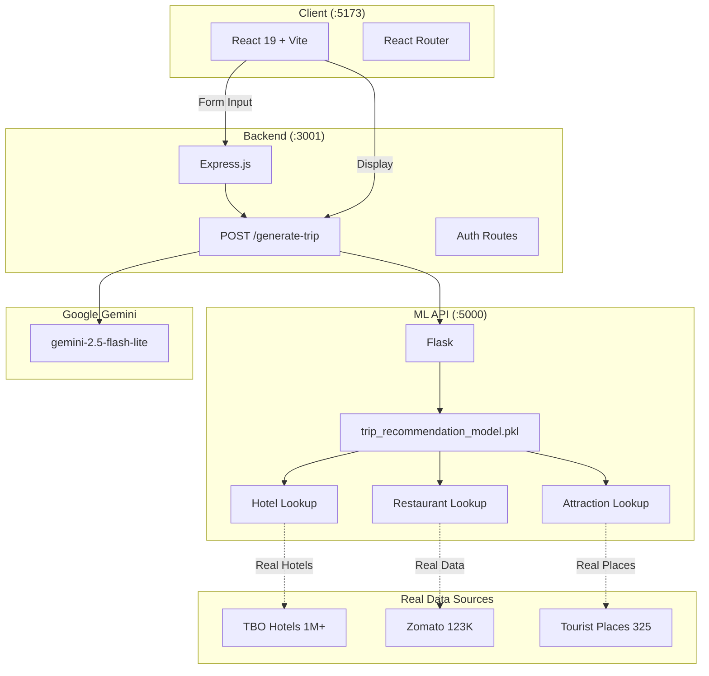

# ✈️ AI Trip Planner

**A complete, interactive AI-powered travel planner that generates personalized itineraries instantly.**

Built with modern web technologies, AI Trip Planner leverages Google's **Gemini AI** for natural language itinerary generation and real-world tourism datasets for authentic recommendations.

---

## 🗺️ System Architecture



## 📊 Data Sources (1M+ Records)

| Source | Records | Purpose |
|--------|----------|---------|
| 🏨 TBO Hotels | 1,010,033 | Hotel recommendations by city & budget |
| 🍽️ Zomato | 123,657 | Restaurant data across 17 cities |
| 🎯 Tourist Places | 325 | Verified attractions with ratings |
| 📊 Cultural Tourism | 5,000 | Satisfaction scores |
| 🚂 Indian Railways | 9,000 | Station & train data |

---

## ✨ Features

- **Personalized Itineraries**: Tell us your budget, companions, and destination. Gemini AI builds a complete day-by-day plan.
- **Custom Restraints**: Lock in strict budget ranges or restrict your plan to up to 6 Specific Places to ensure complete control.
- **Trip Analytics & Score**: Machine Learning API (XGBoost) evaluates your itinerary against Indian Tourism logic to offer a dynamically scored "satisfaction" rating and customized tips.
- **Weather Forecaster**: Built-in 3-day weather widgets for your destination ensure you're never caught off guard.
- **Trip Cost Estimator**: Interactive breakdown charts calculate your total expenses based on group size and luxury tier.
- **Save & Share**: Save your trips locally, bookmark your favorites, export them instantly as fully-styled **PDFs**, or generate share links.
- **Google Maps Integration**: Browse your generated itinerary inline alongside immersive mapped locations.
- **PWA Ready**: Enjoy an offline-capable, installable App experience straight from the browser to your Home Screen.

## 🚀 Tech Stack

| Layer | Technology | Purpose |
|-------|-----------|---------|
| Frontend | React 19 + Vite 7 | SPA with JSX components |
| Styling | Vanilla CSS | Dark-themed, glassmorphism UI |
| Backend | Express.js (Node 20) | REST API on port 3001 |
| ML API | Flask (Python) | Recommendations on port 5000 |
| AI Generation | Gemini 2.5 Flash Lite | Day-by-day itinerary generation |
| Auth & DB | Supabase | User auth, profiles, trip storage |
| Auth Provider | Google OAuth + Email | Via Supabase Auth |

## 🛠️ Installation & Setup

1. **Clone the repository**
   ```bash
   git clone <repository_url>
   cd "Ai-Based Trip Planning/Aitrip"
   ```

2. **Install Frontend Setup**
   ```bash
   npm install
   ```

3. **Install Backend Dependencies** (Optional but recommended for full scale usage)
   Ensure you have a Node environment running in the `backend/` or utilize the unified stack command.

4. **Environment Variables**
   Create a `.env` in the root:
   ```env
   VITE_SUPABASE_URL=your_supabase_url
   VITE_SUPABASE_ANON_KEY=your_supabase_anon_key
   ```
   Create a `.env` inside `backend/`:
   ```env
   GEMINI_API_KEY=your_google_gemini_api_key
   SUPABASE_URL=your_supabase_url
   SUPABASE_KEY=your_supabase_service_role_key
   ```

5. **Start Development Servers (Full Stack)**
   Boots the Frontend, Express Backend, and Python ML API together.
   ```bash
   npm run dev:fullstack
   ```

## 📚 API Architecture
- **`/api/generate-trip` (Node.js)**: Proxies the complex multi-stage itinerary requests to Gemini AI, formats them, and returns JSON.
- **`/predict` (Python Flask)**: Machine Learning evaluation model running on port 5000. Uses a pre-trained regression model across features like *Destination Popularity*, *Budget Match*, etc.
- **`https://wttr.in/:loc?format=j1`**: Serverless call for active weather predictions.

## 🛡️ License
Built by the **Vignan University** software team. Protected under MIT license parameters.
